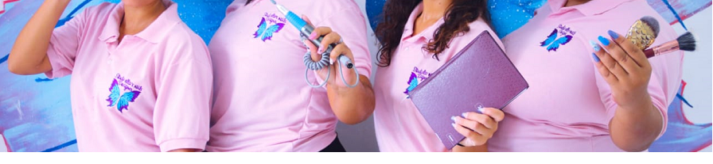

# Workshop Reprograma

 Projeto desenvolvido durante o processo seletivo para ingressar no Reprograma.
 A idéia era criar um site pessoal que poderia ser utilizado como portifólio, mas decidi fazer um site para a firma da família. Um studio especializado em cuidados com as unhas.
 Confiram como ficou o site.
 <https://studio-ellas.netlify.app>

 O workshop teve duração de 8h, nesse dia formos apresentadas as lingaguens de programção e tecnologias abaixo:

 ### Tecnologias Utilizadas
 * VSCODE
 * HTML
 * CSS

### Utilização
**VSCODE** Aprendemos a escrever todo o codigo.

**HTML** Apredemos a criar toda a estrutura de uma página web. 
Os conceitos de _head_, _body_, _footer_, _div_, _class_, _tag_ e _ atributos de navegação.

**CSS** Estilizamos toda a nossa estrutura principal aplicando as propriedades que são mostradas na página web.
Alguns dos fundamentos passados foram _margin_, _padding_, _background_, _width_, _heidth_, _text_, _font_, _border_, _display_ e conceitos de _flex_.

**Gostaria de contribuir/sugerir melhorias para o projeto?**

=> Crie um fork do projeto

=> Crie uma branch chamada feature/seu-nome

=> Faça suas contribuições

=> Faz o commit (quantos precisar)

=> Abre um pull request :)

